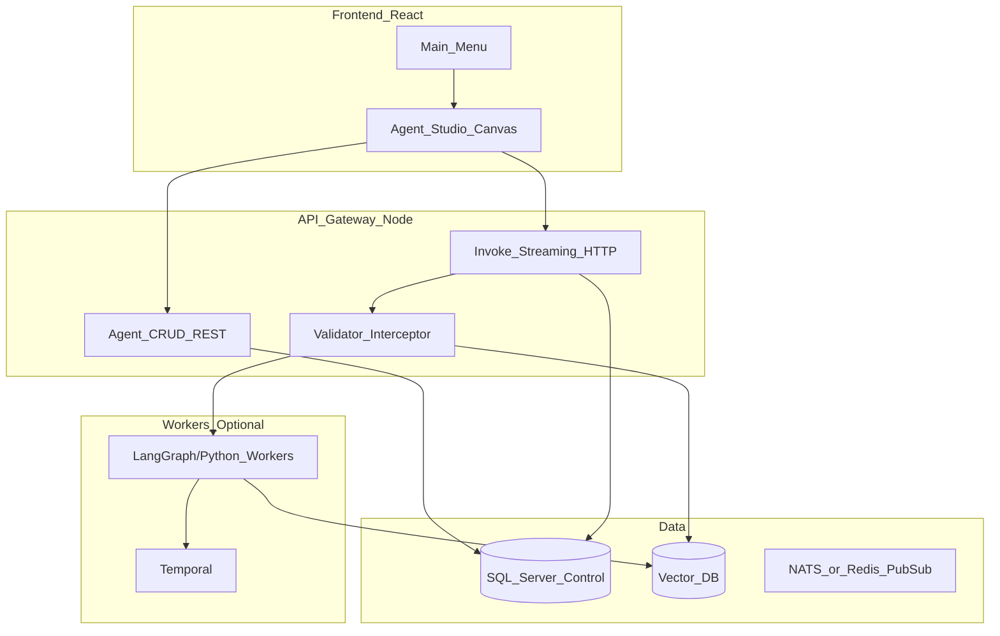

# Build Your Agent: menu + phased platform plan

## Current codebase anchor

- **Main menu**: [components/AiStudioLanding.tsx](components/AiStudioLanding.tsx) — top `nav` section (same pattern as "Build Your APP"), `handleSidebarClick`, and `mainPanelMode` union (~line 328) drive full-width panels (`apiBuilder`, `designStudioLanding`, etc.).
- **Frontend stack**: React 19 + Vite ([package.json](package.json)).
- **API**: Express mounted at `/api` ([server/index.js](server/index.js)), control data in SQL Server under existing routes in [api/](api/).
- **Gap vs your spec**: No React Flow, no Python/LangGraph, no Temporal/NATS/Pinecone in-repo today — those belong in later phases as **additional services** or **optional adapters**, not blockers for the menu + Product v0.

## Phase 0 (implementation in this repo) — Menu + Agent Studio shell

1. **`mainPanelMode`**
   - Extend the union with e.g. `'agentStudio'`.
   - In `handleSidebarClick`, branch on key `'build-your-agent'` (or similar snake-free id): `setMainPanelMode('agentStudio');` and set sensible `activeCollection` / `activeItem`.

2. **Sidebar UI**
   - Add a `<button>` under "Build Your APP" with label **Build Your Agent**, icon ([lucide-react](https://lucide.dev) e.g. `Bot` or `Workflow`), mirroring styling of the existing Sparkles row (~2393–2408).

3. **Mobile / compact nav**
   - If there is a duplicate mobile drawer for the same items (grep for second "Build Your APP"), add **Build Your Agent** there too for parity.

4. **`AgentStudioScreen` (new component)**
   - New file e.g. [components/AgentStudioScreen.tsx](components/AgentStudioScreen.tsx): layout consistent with Profile / API Builder (`min-h-screen`, theme via `isDarkMode`).
   - **Content suited to governance + flexibility framing** without over-promising unsupported infra:
     - **Tabs**: Vision | Standalone Agents | Orchestrators (DAG) | RAG & Ingestion | Security & Guardrails | Roadmap.
     - Each tab summarizes your architecture (markdown-style copy in JSX): personas, Workflow Designer (canvas + MCP), RAG layer, Validator layer — so product and execs see the blueprint.
     - **Stub affordances**: "Create standalone agent" / "Define workflow (JSON/YAML preview)" placeholders that optionally persist to backend in Phase 1.

5. **`AiStudioLanding` render branch**
   - In the conditional chain where `mainPanelMode === 'apiBuilder'` etc. (~2838), add `mainPanelMode === 'agentStudio' ? <AgentStudioScreen … />`.

This delivers the **requested menu link** and a **professional, enterprise-grade narrative surface** aligned to your orchestrator brief.

---

## Phase 1 — Standalone agents + HTTP API (stay in Node/SQL Server first)

Aligned to your roadmap "Phase 1: Standalone Agent framework".

- **Data model** (SQL Server, same pattern as [api/controlDb/sqlserverAppData.js](api/controlDb/sqlserverAppData.js) / apps tables): tables such as `agent_definitions`, `agent_tools` (typed tool refs: http, sql, script), optional `execution_runs` with status.
- **API**: CRUD `/api/agents`, POST `/api/agents/:id/invoke` (sync or chunked stream). Reuse tenant/user identity from existing `x-user-email` middleware if present elsewhere.
- **Runtime**: Lightweight **Node orchestration** invoking existing LLM paths (patterns already used in builder/copilot flows) plus **explicit tool adapters** — not yet LangGraph, but APIs shaped so Python/LangGraph can sit behind `/api/agent-engine` later without breaking the frontend.

Optional: enqueue long jobs in Redis — only if Redis is added to the stack; otherwise keep synchronous/simple queue table.

---

## Phase 2 — Managerial / DAG orchestration

- Persist **DAG** as JSON (`nodes`, `edges`, node types: `agent`, `condition`, `loop`, `hitl`, `trigger`).
- **Executor**: deterministic DAG walker + state machine keyed by `run_id` (table row updates). Validates acyclic graphs on save.
- **Upgrade path**: If runs exceed Node reliability needs, offload **worker execution** to **Temporal Cloud/self-hosted** ([Temporal](https://temporal.io/)) while keeping DSL + UI contracts stable.

---

## Phase 3 — Agent Studio canvas (your "Workflow Designer")

- Add `@xyflow/react` (formerly React Flow) for drag-and-drop; map canvas graph to/from Phase 2 DAG JSON **losslessly**.
- **MCP**: Integrate MCP **client-side or server-side** per security model ([Model Context Protocol](https://modelcontextprotocol.io)): Node MCP host or separate sidecar recommended for enterprise secrets isolation.

---

## Phase 4 — RAG layer + Validator / guardrails

- **Connectors**: web hooks/API ingestion first; scraping as isolated worker job with rate limits.
- **Vector**: Pinecone / Milvus / Weaviate — pick one for v1 embeddings store; expose **embedding + hybrid search API** consumed by agents before LLM calls.
- **Validator layer**: Middleware after LLM (and optionally before) — RAG fidelity checks (citation-required answers), regex/NER PII stripping, injection heuristics, **per-agent budgets** enforced in orchestrator (`max_tokens`, `daily_usd_caps` tables).

Consider **dual-path architecture** early: inference + safety can move to FastAPI/Python (LangChain/LangGraph) while **routing, auth, workflow state** stay on Express until scale demands merge.

---

## Architecture diagram (target state)

---

## Out of scope for initial PR (but documented in Agent Studio UI)

- Full MCP catalog, production Temporal workflows, Pinecone tenancy, hallucination scorer training — tracked as backlog items tied to roadmap phases above.

---

## Files expected to touch (Phase 0)

| Area | Files |
|------|--------|
| Nav + routing | [components/AiStudioLanding.tsx](components/AiStudioLanding.tsx) |
| New UI | New: `components/AgentStudioScreen.tsx` |
| Icons / types | Imports from `lucide-react`, extend `mainPanelMode` |

No backend strictly required until Phase 1.
